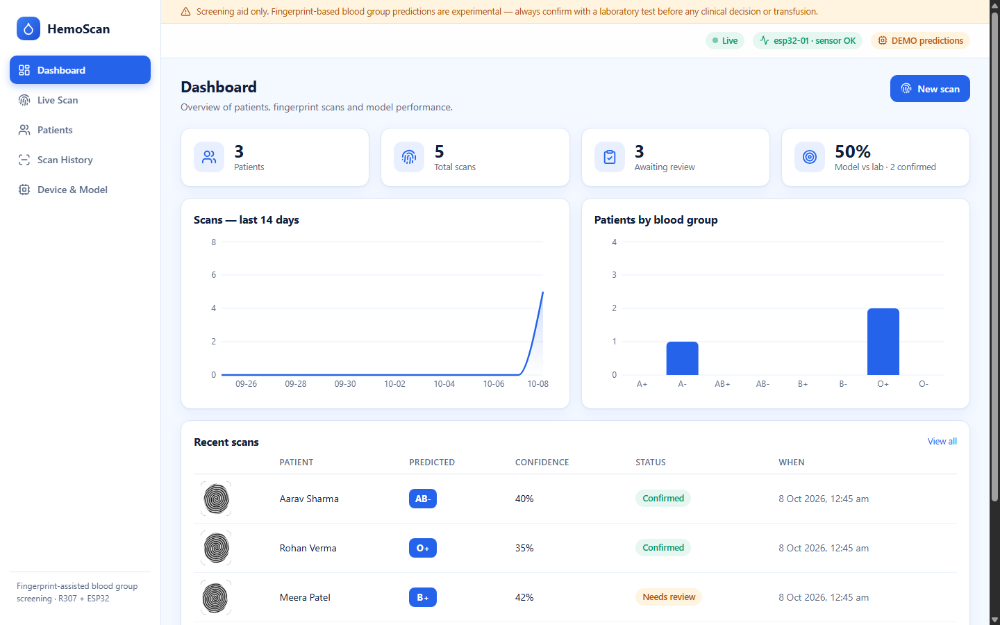
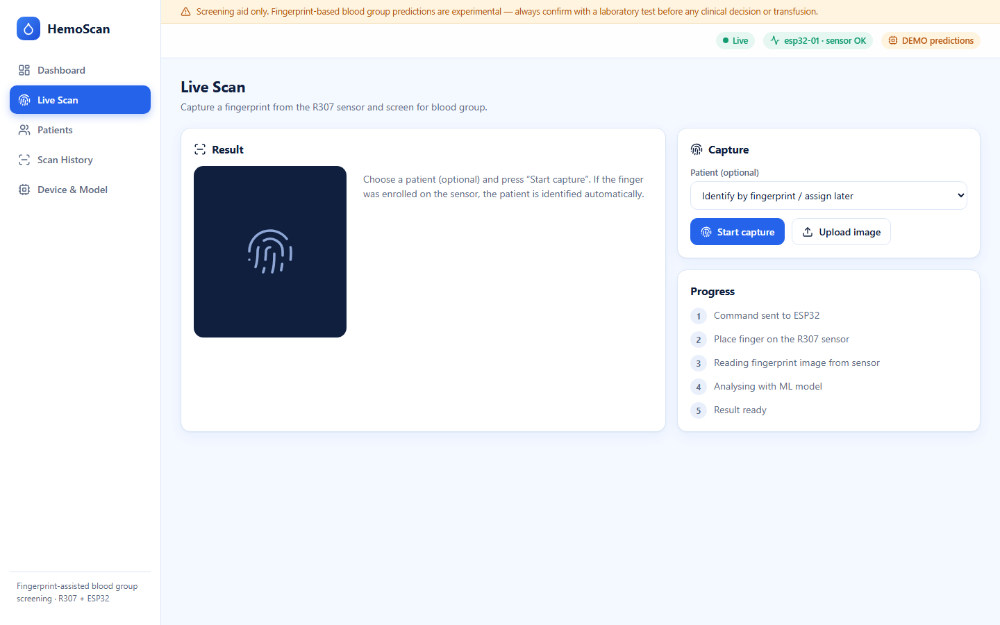
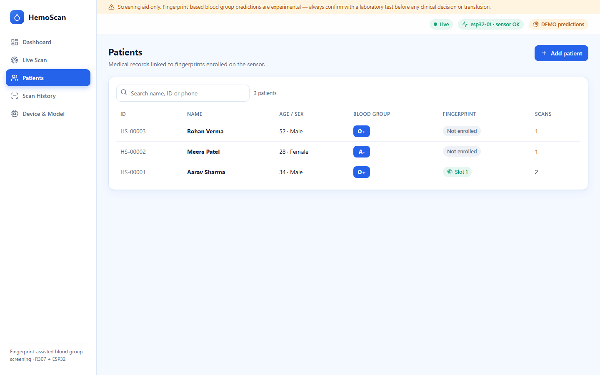
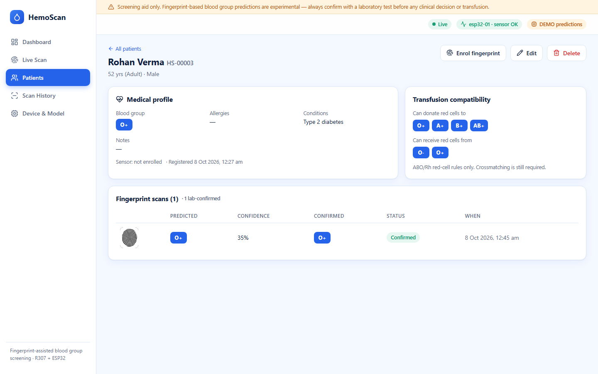
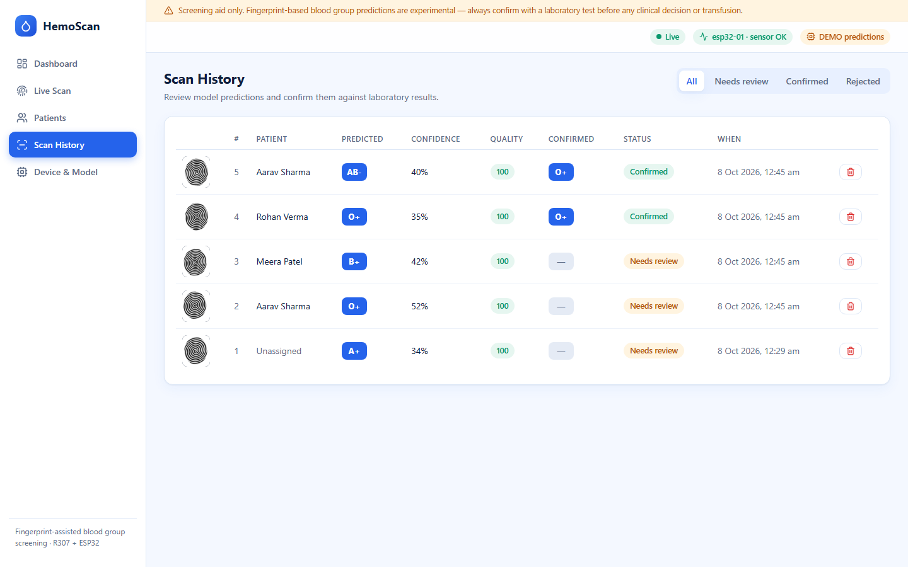
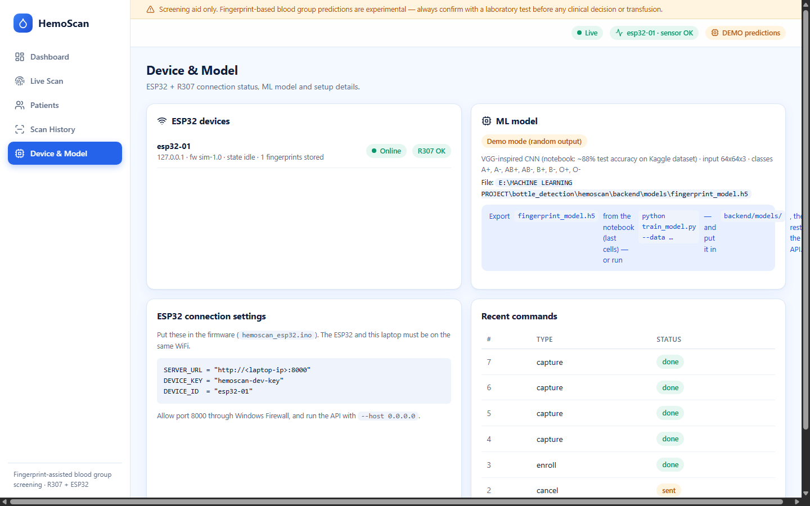
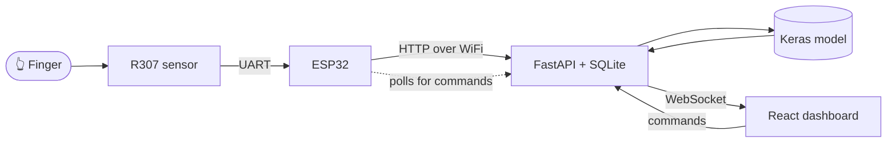
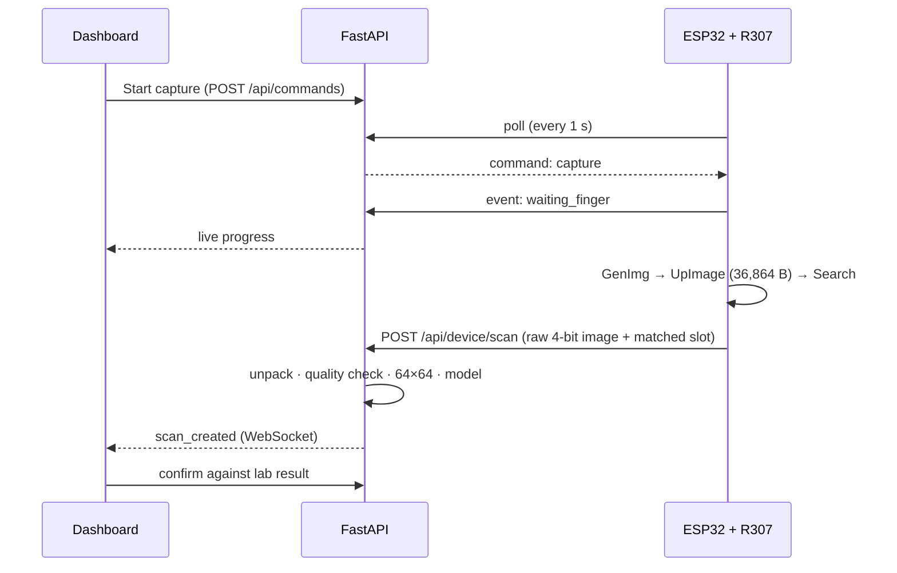

<div align="center">

# 🩸 HemoScan

### Fingerprint-assisted blood group screening — R307 sensor → ESP32 → ML → live medical dashboard




**[Quick start](#-quick-start)** · **[Features](#-features)** · **[How it works](#-how-it-works)** · **[Hardware](#-hardware-setup)** · **[Model](#-the-ml-model)** · **[Limitations](#%EF%B8%8F-limitations--safety)**

</div>

> [!WARNING]
> **Experimental screening aid, not a diagnostic device.** Predicting blood group from a fingerprint is not an established medical method. Always confirm with a laboratory test before any clinical decision or transfusion. Screenshots below use the built-in **demo mode** (random predictions on synthetic fingerprints).

---

## ✨ Features

| | |
|---|---|
| 🖐️ **Live capture** | Press *Start capture* on the dashboard; the ESP32 reads the R307 and the result streams back live over WebSocket |
| 🧠 **ML prediction** | VGG-inspired CNN (64×64) → blood group + confidence + top-4 probabilities, with image-quality grading |
| 🪪 **Patient identification** | Fingerprints are enrolled on the sensor and mapped to patient records — repeat scans identify the patient automatically |
| 🏥 **Patient records** | Demographics, allergies, conditions, notes, scan history, ABO/Rh transfusion-compatibility chart |
| ✅ **Lab-confirmation workflow** | Every prediction must be confirmed or rejected against a lab result; the dashboard tracks model-vs-lab agreement |
| 📊 **Analytics** | Scans per day, patients by blood group, pending reviews, model agreement |
| 🔌 **Hardware simulator** | Develop and test the full stack with no ESP32 or sensor attached |
| 🎨 **Clean UI** | White-and-blue responsive dashboard, live device / model status in the header |

<details>
<summary><b>📸 Screenshots</b> (click to expand)</summary>

| Live Scan | Patients |
|---|---|
|  |  |

| Patient record | Scan review |
|---|---|
|  |  |

| Device & model status |
|---|
|  |

</details>

---

## 🧩 How it works





The ESP32 only makes **outgoing** connections, so no port-forwarding or router setup is needed.

<details>
<summary><b>Enrolment & identification</b></summary>

*Patient page → Enrol fingerprint.* The sensor stores the template in a free slot (1–200) and the backend maps `slot → patient`. On later captures the sensor searches its stored templates, returns the matched slot, and the scan is linked to the patient automatically.
</details>

---

## 🚀 Quick start

> No hardware needed — a simulator stands in for the ESP32 + R307.

**Requirements:** Python 3.8+, Node 18+

```bash
# 1 ─ API  (demo mode = random predictions, clearly flagged, until a model file exists)
cd backend
pip install -r requirements.txt
export HEMOSCAN_DEMO=1          # PowerShell:  $env:HEMOSCAN_DEMO=1
python -m uvicorn app.main:app --host 0.0.0.0 --port 8000

# 2 ─ Simulated ESP32 + sensor  (new terminal, from backend/)
python tools/esp32_simulator.py

# 3 ─ Dashboard  (new terminal)
cd frontend
npm install
npm run dev                     # → http://localhost:5173
```

Then: **Patients → Add → Enrol fingerprint**, **Live Scan → Start capture**, **Confirm** the result.

Single-process mode: `npm run build` once, then open `http://localhost:8000`. API docs at `/docs`.
Verify everything: `python backend/tests/e2e.py` (14 checks, API + simulator running).

---

## 🧠 The ML model

* CNN based on the original notebook's VGG-inspired network: 4 conv blocks (2 convs each) → dense layers → 8-class softmax (`A+ A- AB+ AB- B+ B- O+ O-`), input 64×64×3.
* The default is a **lighter version**: half the filter widths (32→256) plus BatchNorm, so it trains on a laptop CPU in well under an hour. `vgg_inspired(widths=(64,128,256,512))` gives the notebook's full size.
* Training and the live API share the same preprocessing (`backend/app/imaging.py`), so the model sees identical inputs in both.

**Train**

```bash
python ml/train_model.py --data ml/data/dataset_blood_group --epochs 40
# → backend/models/fingerprint_model.h5  +  backend/models/metrics.json
```

Restart the API without `HEMOSCAN_DEMO`; the header pill switches from **DEMO predictions** to **Model loaded**.

**How the evaluation is kept honest**

| Step | Why |
|---|---|
| 15 exact-duplicate images removed *before* splitting | no copy of a test image can be in training |
| Stratified 70 / 15 / 15 train / val / test split on the **original** images | augmented copies never leak across splits |
| Augmentation (small shifts, rotation, zoom) on the training set only | the notebook's flips and 90° turns were applied before splitting |
| Best epoch chosen on validation; test set evaluated once at the end | no tuning on test data |
| Full per-class report and confusion matrix saved to `metrics.json` | see where it fails |

<details>
<summary><b>Dataset audit</b></summary>

6,000 images, all readable, 8 classes: A+ 565 · A− 1,009 · AB+ 708 · AB− 761 · B+ 652 · B− 741 · O+ 852 · O− 712 (imbalanced). 5,956 are 103×96 and 44 are 298×241 (all resized to 64×64). 11 groups of exact duplicates (none across classes). Filenames carry no person ID, so the same person's fingers could appear in both train and test; the test score may therefore be optimistic.
</details>

<details>
<summary><b>Reference results from the original notebooks (<code>ml/notebooks</code>)</b></summary>

These are the authors' reported numbers, not produced by this project's training script.

| Model | Reported held-out accuracy |
|---|---|
| ResNet50 (transfer learning, 256×256, 80/20 split on original images) | ≈ 81 % |
| VGG16 | ≈ 74 % |
| VGG-inspired from scratch (notebook 01) | ≈ 88 %, but augmented copies were split across train and test, which inflates it |
| AlexNet / LeNet | did not train / heavy overfitting |

The pretrained ResNet `.h5` that came with the reference repo was saved with Keras 3 and cannot be loaded by TensorFlow 2.13, so it was removed.
</details>

---

## 🔌 Hardware setup

| R307 wire | ESP32 pin |
|---|---|
| Red (VCC) | 3V3 |
| Black (GND) | GND |
| Yellow (TX) | GPIO 16 |
| White (RX) | GPIO 17 |

1. Open `firmware/hemoscan_esp32/hemoscan_esp32.ino`; set `WIFI_SSID`, `WIFI_PASS`, `SERVER_URL` (laptop IP).
2. Install the **ArduinoJson** library, choose *ESP32 Dev Module*, flash.
3. Same WiFi for laptop and ESP32; allow inbound **TCP 8000** in Windows Firewall; run the API with `--host 0.0.0.0`.
4. The header shows **`esp32-01 · sensor OK`** when connected.

> [!NOTE]
> The firmware follows the R307 datasheet but has **not yet been run on real hardware** — expect to tune timeouts. Reading an image at 57,600 baud takes ~10 s.

---

## 🗂️ Project structure

```
hemoscan/
├── backend/               FastAPI service
│   ├── app/               main.py · db.py · ml.py · imaging.py · hub.py
│   ├── models/            ← put fingerprint_model.h5 here
│   ├── tools/             esp32_simulator.py
│   └── tests/             e2e.py
├── frontend/              React + Vite dashboard (pages/ · components/)
├── firmware/              hemoscan_esp32/hemoscan_esp32.ino
├── ml/                    train_model.py · notebooks/ · data/ · reference/
└── docs/screenshots/
```

<details>
<summary><b>API reference</b></summary>

| Endpoint | Used by |
|---|---|
| `GET/POST /api/patients` · `GET/PUT/DELETE /api/patients/{id}` | dashboard |
| `GET /api/scans` · `PATCH/DELETE /api/scans/{id}` · `POST /api/scans/upload` | dashboard |
| `GET /api/stats` · `/api/model` · `/api/devices` · `POST /api/commands` | dashboard |
| `POST /api/device/heartbeat` · `GET /api/device/poll` · `POST /api/device/event` · `POST /api/device/scan` · `POST /api/device/enroll_result` | ESP32 (header `X-Device-Key`) |
| `WS /ws` | live updates |
</details>

<details>
<summary><b>Configuration</b></summary>

| Variable | Default | Meaning |
|---|---|---|
| `HEMOSCAN_DEMO` | unset | `1` = random demo predictions when no model file exists |
| `HEMOSCAN_MODEL` | `backend/models/fingerprint_model.h5` | model path |
| `HEMOSCAN_DATA` | `backend/data` | database + scan images |
| `HEMOSCAN_DEVICE_KEY` | `hemoscan-dev-key` | shared secret sent by the ESP32 — change it together with `DEVICE_KEY` in the firmware |
</details>

---

## 🗺️ Status & roadmap

- [x] FastAPI backend, SQLite, WebSocket live feed, end-to-end tests
- [x] React dashboard (6 pages), patient records, compatibility chart
- [x] ESP32 simulator
- [x] ESP32 firmware written
- [x] Dataset audited, de-duplicated, leak-free training pipeline (`ml/train_model.py`)
- [ ] Final trained model exported and test accuracy published here
- [ ] Test firmware on real R307 + ESP32 hardware
- [ ] Collect R307-sensor images with lab labels and fine-tune
- [ ] User login, roles, HTTPS, encrypted storage

## ⚠️ Limitations & safety

* The reference dataset comes from a different scanner than the R307; **expect lower accuracy on real R307 images.** The app measures real agreement with lab results so you can see it.
* Low-confidence and low-quality scans are flagged; nothing is treated as a diagnosis.
* **Privacy:** patient data is stored unencrypted in `backend/data/hemoscan.db` and there is **no login**. Do not use with real patient data on a shared network until authentication and HTTPS are added.

## 📝 Notes

The dataset (`ml/data/`) and trained `.h5` models are git-ignored because of their size — download the *Finger Print Based Blood Group Dataset* from Kaggle and place the 8 class folders in `ml/data/dataset_blood_group/`. Original reference notebooks keep their upstream licences (`ml/reference/LICENSE`).
