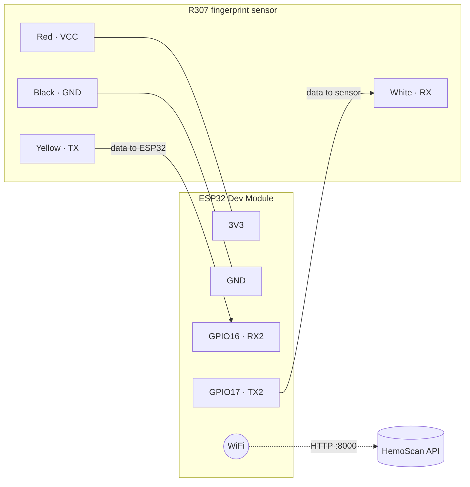
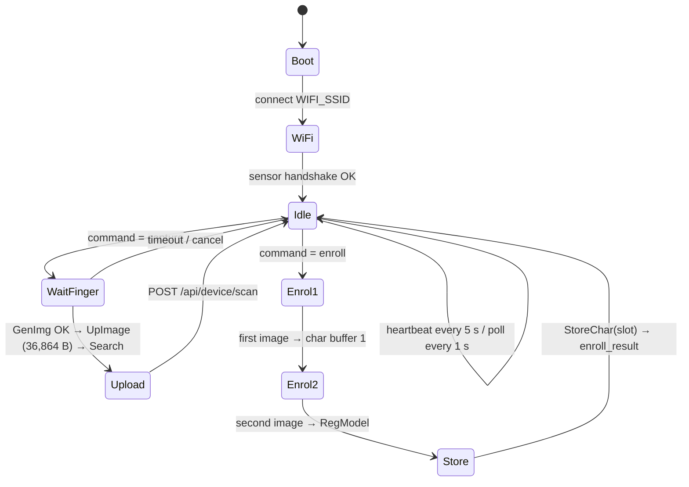

# 2. Hardware — wiring and firmware states

```mermaid
flowchart LR
    subgraph R307["R307 fingerprint sensor"]
        V[Red · VCC]
        G[Black · GND]
        TX[Yellow · TX]
        RX[White · RX]
    end
    subgraph ESP32["ESP32 Dev Module"]
        P33[3V3]
        PG[GND]
        P16[GPIO16 · RX2]
        P17[GPIO17 · TX2]
        W(("WiFi"))
    end
    V --- P33
    G --- PG
    TX -- data to ESP32 --> P16
    P17 -- data to sensor --> RX
    W -. "HTTP :8000" .-> S[(HemoScan API)]
```

```mermaid
stateDiagram-v2
    [*] --> Boot
    Boot --> WiFi: connect WIFI_SSID
    WiFi --> Idle: sensor handshake OK
    Idle --> Idle: heartbeat every 5 s / poll every 1 s
    Idle --> WaitFinger: command = capture
    WaitFinger --> Upload: GenImg OK → UpImage (36,864 B) → Search
    WaitFinger --> Idle: timeout / cancel
    Upload --> Idle: POST /api/device/scan
    Idle --> Enrol1: command = enroll
    Enrol1 --> Enrol2: first image → char buffer 1
    Enrol2 --> Store: second image → RegModel
    Store --> Idle: StoreChar(slot) → enroll_result
```
