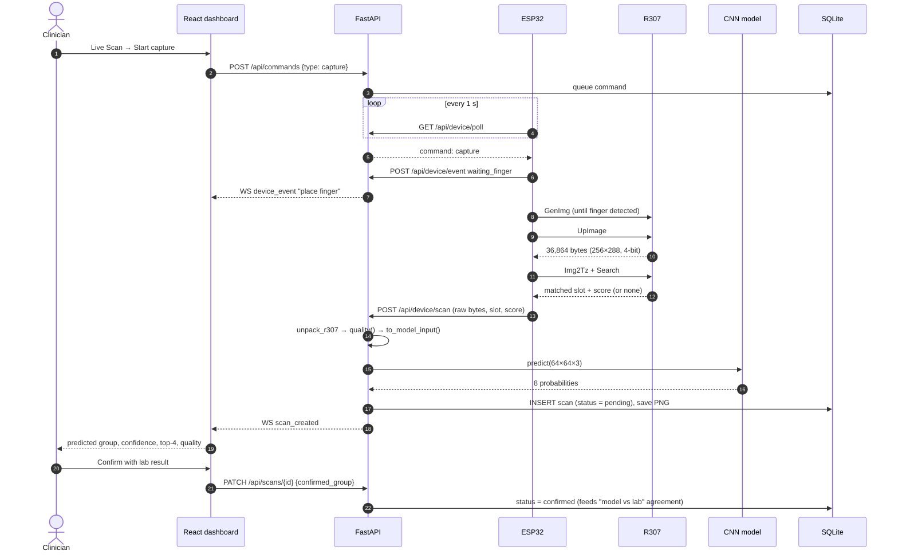

# 3. Live capture — one scan end to end

```mermaid
sequenceDiagram
    autonumber
    actor U as Clinician
    participant UI as React dashboard
    participant API as FastAPI
    participant ESP as ESP32
    participant S as R307
    participant M as CNN model
    participant DB as SQLite

    U->>UI: Live Scan → Start capture
    UI->>API: POST /api/commands {type: capture}
    API->>DB: queue command
    loop every 1 s
        ESP->>API: GET /api/device/poll
    end
    API-->>ESP: command: capture
    ESP->>API: POST /api/device/event waiting_finger
    API-->>UI: WS device_event "place finger"
    ESP->>S: GenImg (until finger detected)
    ESP->>S: UpImage
    S-->>ESP: 36,864 bytes (256×288, 4-bit)
    ESP->>S: Img2Tz + Search
    S-->>ESP: matched slot + score (or none)
    ESP->>API: POST /api/device/scan (raw bytes, slot, score)
    API->>API: unpack_r307 → quality() → to_model_input()
    API->>M: predict(64×64×3)
    M-->>API: 8 probabilities
    API->>DB: INSERT scan (status = pending), save PNG
    API-->>UI: WS scan_created
    UI-->>U: predicted group, confidence, top-4, quality
    U->>UI: Confirm with lab result
    UI->>API: PATCH /api/scans/{id} {confirmed_group}
    API->>DB: status = confirmed (feeds "model vs lab" agreement)
```
