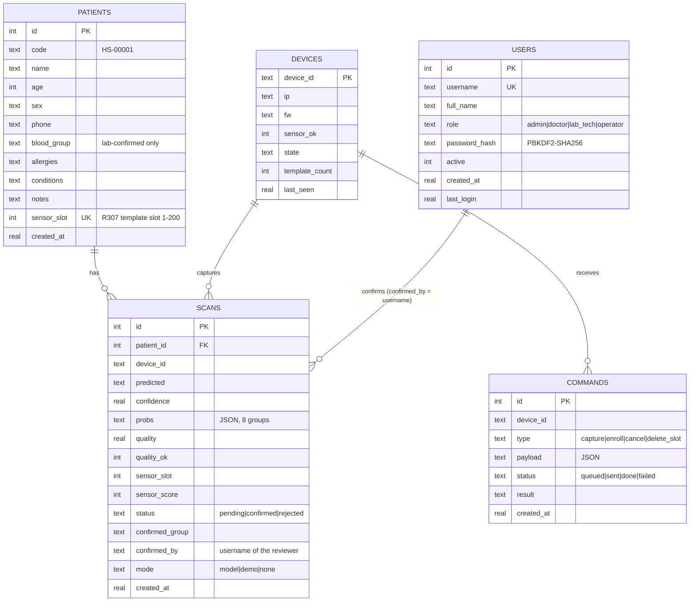

# 8. Database (SQLite, `backend/app/db.py`)

```mermaid
erDiagram
    PATIENTS ||--o{ SCANS : "has"
    DEVICES ||--o{ COMMANDS : "receives"
    DEVICES ||--o{ SCANS : "captures"
    USERS ||--o{ SCANS : "confirms (confirmed_by = username)"

    PATIENTS {
        int id PK
        text code "HS-00001"
        text name
        int age
        text sex
        text phone
        text blood_group "lab-confirmed only"
        text allergies
        text conditions
        text notes
        int sensor_slot UK "R307 template slot 1-200"
        real created_at
    }
    SCANS {
        int id PK
        int patient_id FK
        text device_id
        text predicted
        real confidence
        text probs "JSON, 8 groups"
        real quality
        int quality_ok
        int sensor_slot
        int sensor_score
        text status "pending|confirmed|rejected"
        text confirmed_group
        text confirmed_by "username of the reviewer"
        text mode "model|demo|none"
        real created_at
    }
    USERS {
        int id PK
        text username UK
        text full_name
        text role "admin|doctor|lab_tech|operator"
        text password_hash "PBKDF2-SHA256"
        int active
        real created_at
        real last_login
    }
    DEVICES {
        text device_id PK
        text ip
        text fw
        int sensor_ok
        text state
        int template_count
        real last_seen
    }
    COMMANDS {
        int id PK
        text device_id
        text type "capture|enroll|cancel|delete_slot"
        text payload "JSON"
        text status "queued|sent|done|failed"
        text result
        real created_at
    }
```
