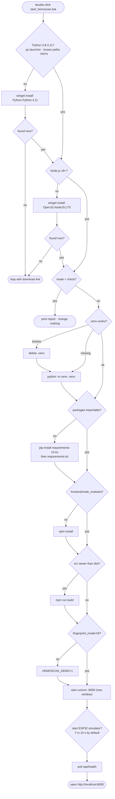

# 9. `start_hemoscan.bat` on a new PC

```mermaid
flowchart TD
    S([double-click start_hemoscan.bat]) --> PY{"Python 3.8-3.11?<br/>py launcher · known paths · PATH"}
    PY -- no --> WPY["winget install Python.Python.3.11"] --> PY2{found now?}
    PY2 -- no --> FAIL([stop with download link])
    PY -- yes --> NODE
    PY2 -- yes --> NODE{"Node.js 18+?"}
    NODE -- no --> WN["winget install OpenJS.NodeJS.LTS"] --> NODE2{found now?}
    NODE2 -- no --> FAIL
    NODE -- yes --> CHK{"mode = check?"}
    NODE2 -- yes --> CHK
    CHK -- yes --> REP([print report · change nothing])
    CHK -- no --> VENV{".venv works?"}
    VENV -- broken --> DEL[delete .venv] --> MK
    VENV -- missing --> MK[python -m venv .venv]
    VENV -- ok --> DEPS
    MK --> DEPS{"packages importable?"}
    DEPS -- no --> PIP["pip install requirements-ml.txt<br/>then requirements.txt"]
    DEPS -- yes --> NPM
    PIP --> NPM{"frontend/node_modules?"}
    NPM -- no --> NI[npm install] --> BLD
    NPM -- yes --> BLD{"src newer than dist?"}
    BLD -- yes --> NB[npm run build] --> MOD
    BLD -- no --> MOD{"fingerprint_model.h5?"}
    MOD -- no --> DEMO[HEMOSCAN_DEMO=1] --> API
    MOD -- yes --> API["start uvicorn :8000 (new window)"]
    API --> SIM{"start ESP32 simulator?<br/>Y in 10 s by default"}
    SIM --> WAIT["poll /api/health"] --> OPEN([open http://localhost:8000])
```

Arguments: `nosim` (real hardware), `train` (train before starting), `check` (report only).
